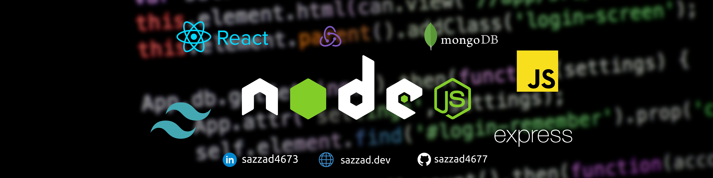

## Hi there my gorgeous friend 👋

I'm Sazzad, a passionate Web Developer from  Bangladesh. I Spend most of time coding outstanding projects or problem solving.

☕&emsp;Connect with me!

  

:heart: &emsp;I enjoy programming and sharing knowledge  
:computer: &emsp;Most used line of code `console.log("hello world")`  
🤔 &emsp; I’m currently learning React-Native 
:e-mail: &emsp;How to reach me: sazzad4677@gmail.com. 
⚡ &emsp;Fun fact:  I really love to travel and explore new things in my free time. 
📝&emsp; Please have a look at my [Resume](https://drive.google.com/file/d/11EVdIh9TtiJNri7Lcqfu9tS0cilH_jri/view?usp=sharing) for more details about me. I'm open to feedback and suggestions!

#### Things I code with

        

### My Projects

  <table>
  <thead >
    <tr border: none;>
      <td><b>Projects Repo</b></td>
      <td><b>Description</b></td>
      <td><b>Start-End</b></td>
    </tr>
  </thead>
  <tbody>
    <tr>
      <td><a href="https://github.com/sazzad4677/GoMart-Frontend" target="_blank">Go Mart</a></td>
      <td>A web app allows users to purchase items using their beautiful voices. This app is currently in the development. Take a look inside. </td>
       <td>Jan 01, 2022 - On Going</td>
    </tr>
    <tr>
      <td><a href="https://github.com/sazzad4677/Go-Study-Client" target="_blank">Go Study</a></td>
      <td>This is a student and teacher demonstration project where the instructor may develop courses and display them on the home page. A site administrator who can log in and add another administrator or instructor to the database.</td>
      <td>Jun 20, 2020 - Jun 25, 2020</td>
    </tr>
    <tr>
      <td><a href="https://github.com/sazzad4677/Wild-Tiger-Wheels">Wild Tiger Wheels</a></td>
      <td>A single-page responsive destination search system based on vehicles.</td>
      <td>Jun 03, 2020 - Jun 08, 2020</td>
    </tr>
    <tr>
      <td><a href="https://github.com/sazzad4677/node-js-practice">Weather APP</a></td>
      <td>Node js based api call</td>
      <td>Sep 17, 2021 - Sep 17, 2021</td>
    </tr>
  </tbody>
</table>

#### Profile Visits

#### Github Stats

