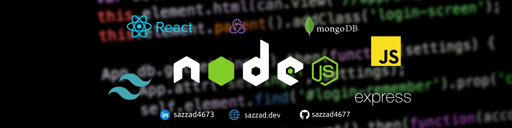

  

# Hi there, I'm Sazzad Hossain 👋
### Building high-performance Real-Time systems and AI-integrated applications with Next.js 16, React 19, and Node.js.

  
  
  

---

### 🔭 Currently Working On
- **AI-Powered Smart Inventory System**: A production-ready monorepo with real-time stock orchestration and Gemini AI insights.
- **Next.js 16 & React 19 Migration**: Implementing the latest stable/canary features for high-performance enterprise SaaS.

### 🚀 Technical Highlights
- 👯 **Looking to collaborate on**: Open-source projects involving **WebRTC**, **Socket.io**, or **Next.js 16** architecture.
- 🌱 **Learning**: Advanced **Generative AI** workflows and **Cloud Orchestration** (Docker/Kubernetes).
- 💬 **Ask me about**: Real-time communication, **Zustand** state management, and **Express 5** backend optimization.
- ⚡ **Fun Fact**: I firmly believe that "it worked on my machine" should be a valid legal defense.

---

### 🛠 Things I Code With

**Frontend & Architecture**

**Backend & Real-Time**

**DevOps & AI**

---

### 📊 GitHub Stats

  
  

