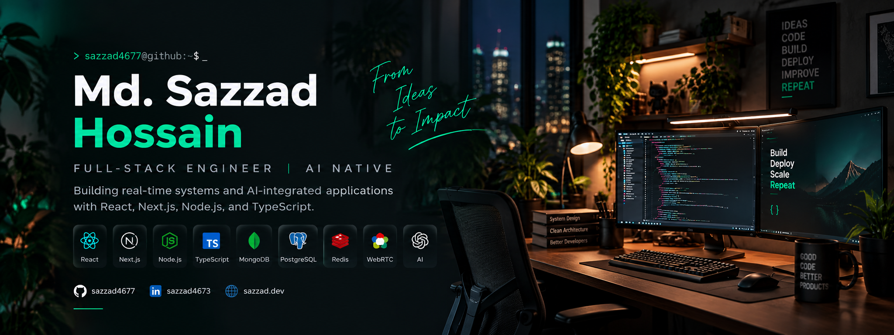

  

# Hi there, I'm Sazzad Hossain 👋

### Full-Stack Engineer building real-time systems and AI-integrated applications with React, Next.js, Node.js, and TypeScript.

  
  
  

---

### 🚀 Currently Building

- **AI-Powered Smart Inventory System** — A production-focused full-stack platform with real-time inventory workflows, business intelligence dashboards, AI-generated insights, and automated restock recommendations.
- **AI-Integrated Developer Portfolio** — A modern portfolio with an AI-powered assistant designed to provide context-aware information about my experience, projects, and technical work.

### 🧠 Technical Focus

- ⚡ **Full-Stack Development:** React, Next.js, Node.js, TypeScript
- 🤖 **AI Integration:** LLM APIs, OpenRouter, AI-powered application workflows
- 📡 **Real-Time Systems:** WebRTC, Socket.io, real-time communication
- 🗄️ **Backend & Data:** Express.js, PostgreSQL, MongoDB, Prisma, Redis
- ☁️ **Cloud & DevOps:** AWS, Docker, GitHub Actions, CI/CD

### 🤝 Open to Collaboration

I'm interested in collaborating on open-source projects involving:

- **WebRTC & real-time communication**
- **AI-integrated applications**
- **Next.js / React architecture**
- **Node.js backend systems**
- **Developer tools and SaaS products**

### 🌱 Currently Learning

- Advanced Generative AI workflows
- AI-native application architecture
- Cloud infrastructure and orchestration
- System design and scalable backend architecture

### 💬 Ask Me About

Real-time communication, WebRTC, Socket.io, React/Next.js architecture, Node.js backends, TypeScript, Prisma, Redis, and AI integration.

### ⚡ Fun Fact

I firmly believe that "it worked on my machine" should be a valid legal defense.

---

### 🛠 Things I Code With

**Frontend & Architecture**

**Backend & Real-Time**

**AI, Cloud & DevOps**

---

### 📊 GitHub Stats

  

